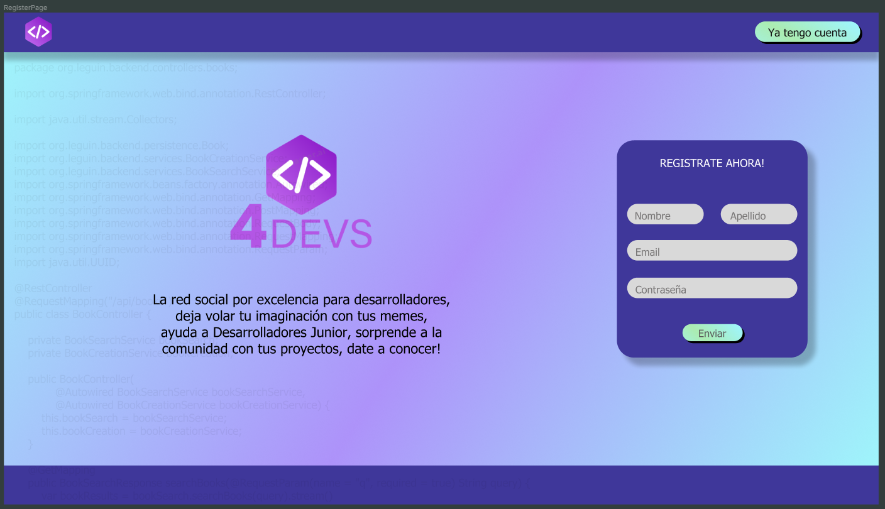
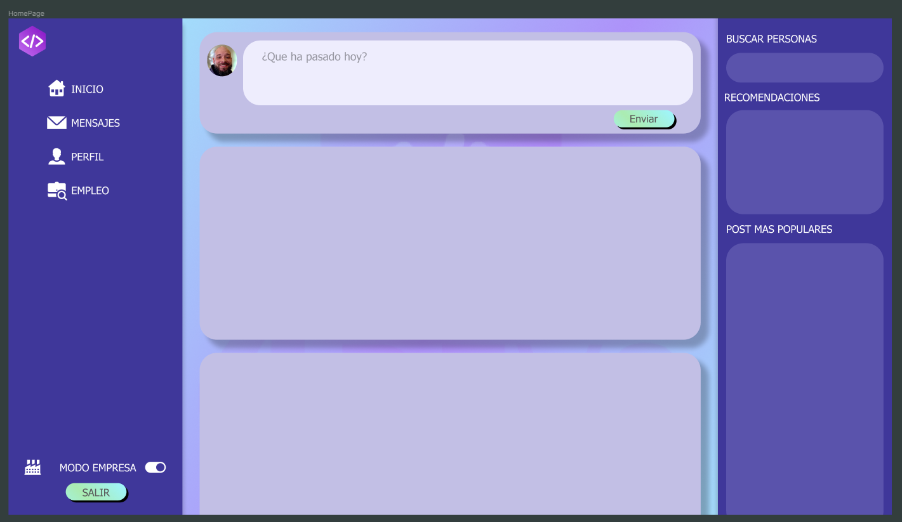
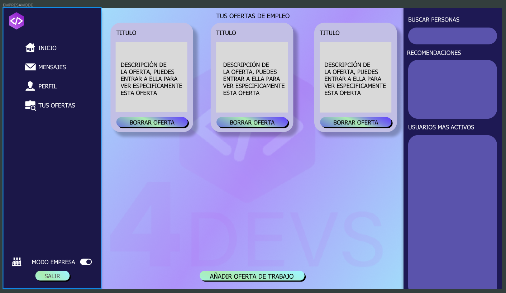

# rc2-template-proyecto-individual-final

# 4Devs

## Red Social creada por y para desarrolladores.
### User Journey

La idea principal de la aplicación tiene dos enfoques, el del usuario ( Junior, Senior, etc) y la de la empresa ( Empresas que buscan desarrolladores )
Como Desarrollador:
- Podrás enseñar tus proyectos, pedir opiniones, colaboraciones, podrás enseñar errores en el codigo, problemas que tienes y buscar soluciones, seria un como [star](https://stackoverflow.com/) pero en red social y con pequeñas diferencias.
- Podrás ayudar con tus conocimientos a los post de otros desarrolladores.
- Como usuario que hace un post tendras la posibilidad de votar esa constación como que te ha servido de ayuda, no solo en codigo sino en general, eso hara que esa persona consiga "puntos" "estrellas", digamos que sera un tipo de nivel.
- Al recibir ese nivel, ese puntuaje, apareceras como los usuarios mas activos y que mas ayudan en la comunidad.

Como Empresa:
- Podrás ofertas puestos de trabajo disponibles, puestos de trabajo con gente con una experiencia inferior a 2 años, para todos los demas hay cientos de portales de trabajo.
- Podrás ver quien son los usuarios que mas ayudan sin animo de lucro a los demas desarrolladores, eso te hara conocer primero el tipo de trabajador y segundo las aptitudes.

¿Por que es diferente?
- Por que no solo valoras la experiencia, si no las ganas de ayudar a los demas, algo muy importante en una empresa.
- Motivaras a personas que no tienes experiencia laboral a demostrar de lo que son capaces.
- Centralizaras a Juniors en una sola red social, apoyandose mutuamente, y el que no apoye no escalara en esa "clasificación".
- Conocer experiencias de otros usuarios y empresas.
- Conseguir que las empresas puedan crear eventos, proyectos publicos para ver las aptitudes y conocer desarrolladores.
## Boceto Figma RegisterPage

